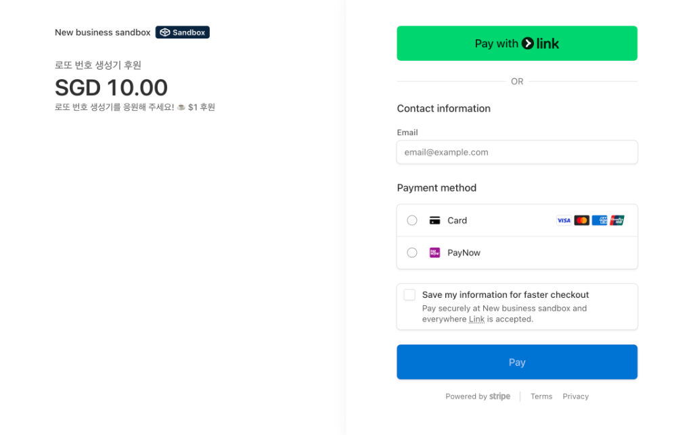

# 로또 번호 생성기 (Lotto Number Generator)

사용자가 행운의 로또(6/45) 번호를 뽑을 수 있도록 도와주는 깔끔한 단일 페이지 웹 애플리케이션입니다.

## 기능 설명
*   **글래스모피즘(Glassmorphism) UI**: 트렌디하고 세련된 반투명 카드 디자인.
*   **다중 추첨**: `-`, `+` 버튼을 통해 한 번에 1~5장(게임)의 번호를 동시에 추첨할 수 있습니다.
*   **번호 색상화**: 실제 로또공처럼 번호 대역별로 다른 색상(노랑, 파랑, 빨강, 회색, 초록)을 자동으로 부여합니다.
*   **추첨 기록**: 최근 뽑은 번호들을 최대 5게임까지 하단에 기록으로 보존해줍니다.

## 💸 결제(후원) 연동 (Stripe Payment Links)
백엔드 서버가 없는 정적 웹 호스팅 환경(GitHub Pages 등)에서도, Stripe의 **‘Payment Links’(결제 링크)** 기능을 활용하여 손쉽게 결제를 연동했습니다.

### 연동 원리 (서버리스 방식)
1.  Stripe 대시보드의 **상품(Products)** 메뉴에서 상품(후원 티어)과 가격(ex: 1 SGD, 10 SGD)을 생성합니다.
2.  해당 가격에 대해 **결제 링크(Payment Links)**를 생성합니다. (HTML에 삽입할 수 있는 `https://buy.stripe.com/...` 형태의 고유 URL이 생성됨)
3.  생성된 링크를 `index.html` 내에 1 SGD, 10 SGD, 100 SGD 등의 `<a>` 태그 URL로 지정하기만 하면 끝납니다. (기본 `target="_blank"` 속성을 제거하면 페이지 이동이 현재 창에서 매끄럽게 이루어집니다.)

### 결제 완료 후 기존 페이지 복귀 및 모달 표시(Redirect & URL Parameter)
Stripe 결제 후 브라우저가 기본 결제 완료 화면에 멈춰있지 않고, 다시 우리 웹 애플리케이션(원래 화면)으로 자연스럽게 돌아와 성공 모달을 띄우는 핵심 노하우입니다.

1.  **리디렉션 URL 설정**:
    *   Stripe 대시보드의 **결제 링크 편집** 화면에 들어갑니다.
    *   **결제 후(After payment)** 설정 탭에서 `확인 페이지 표시 안 함(Don't show confirmation page)`을 선택합니다.
    *   리디렉션(Redirect) URL 입력 칸에, 나의 웹사이트 주소 뒤에 쿼리 스트링 `?payment=success`를 붙여서 저장합니다.  
        *(예: `https://hojungyun-lab.github.io/lotto-generator/?payment=success`)*
    *   **주의**: 이미 만들어진 링크의 리디렉션을 나중에 수정하려면 Edit 버튼이 막혀있는 경우가 있습니다. 이 경우 **위 주소를 리디렉션 란에 넣은 채로 링크를 완전히 새로 발급받는 것**이 가장 확실합니다.

2.  **클라이언트(JavaScript) URL 쿼리 파라미터 감지**:
    *   결제 완료 후 사용자가 돌아오면, Javascript는 URL에 `payment=success`가 존재하는지 검사합니다.
    *   존재한다면 `class="modal-overlay"` 등의 CSS 선택자를 이용해 "결제가 성공했습니다" 모달 창을 띄웁니다.
    *   브라우저의 `history.replaceState` API를 사용하여 쿼리 스트링(`?payment=success`)을 주소창에서 깔끔하게 즉시 지워줍니다. (새로고침 시 모달이 계속 뜨는 것 방지)

## 배포
이 프로젝트는 **GitHub Pages**를 통해 호스팅되며 수동 빌드(배포) 과정 없이 `main` 브랜치에 코드가 푸시되면 자동으로 반영됩니다.
